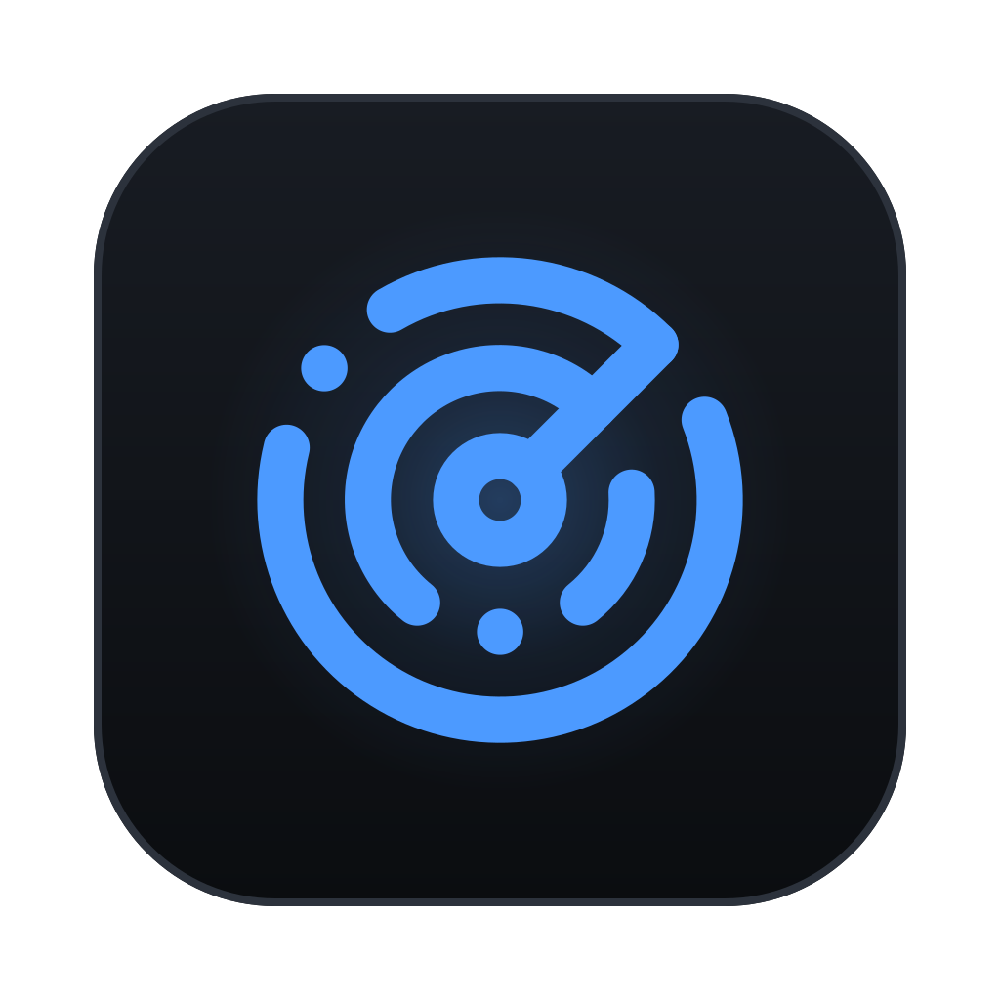
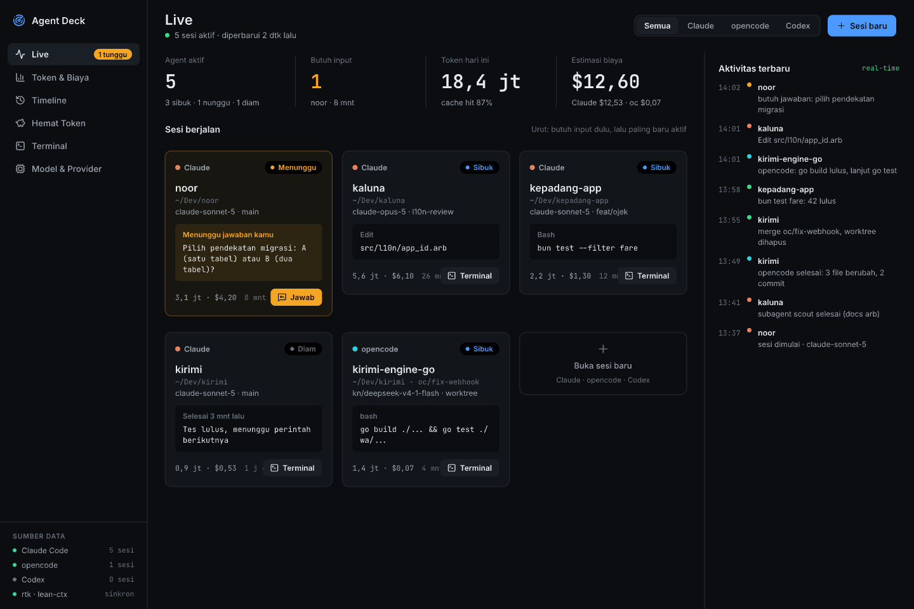
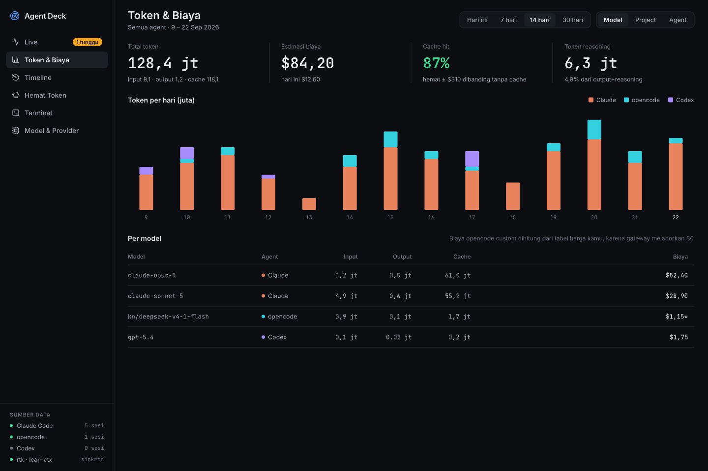
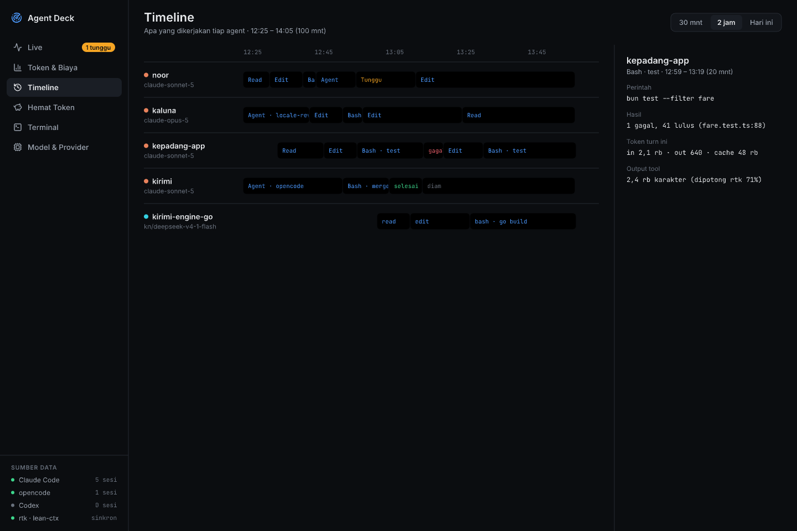
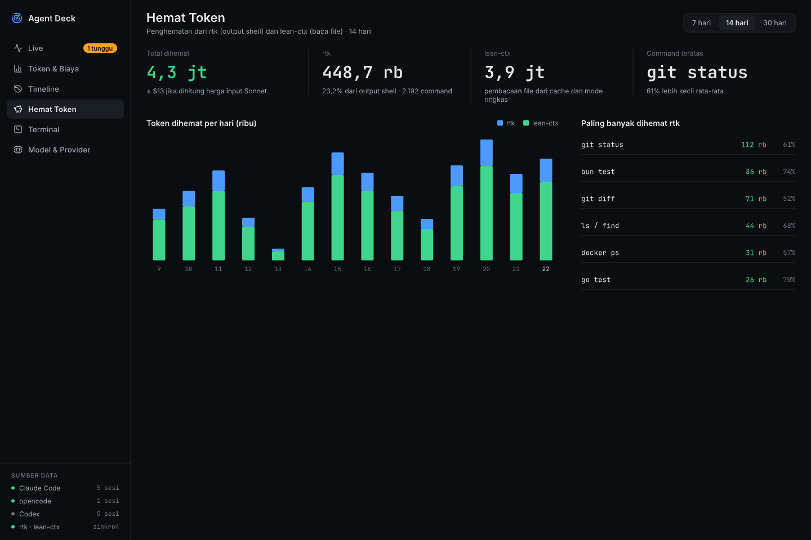
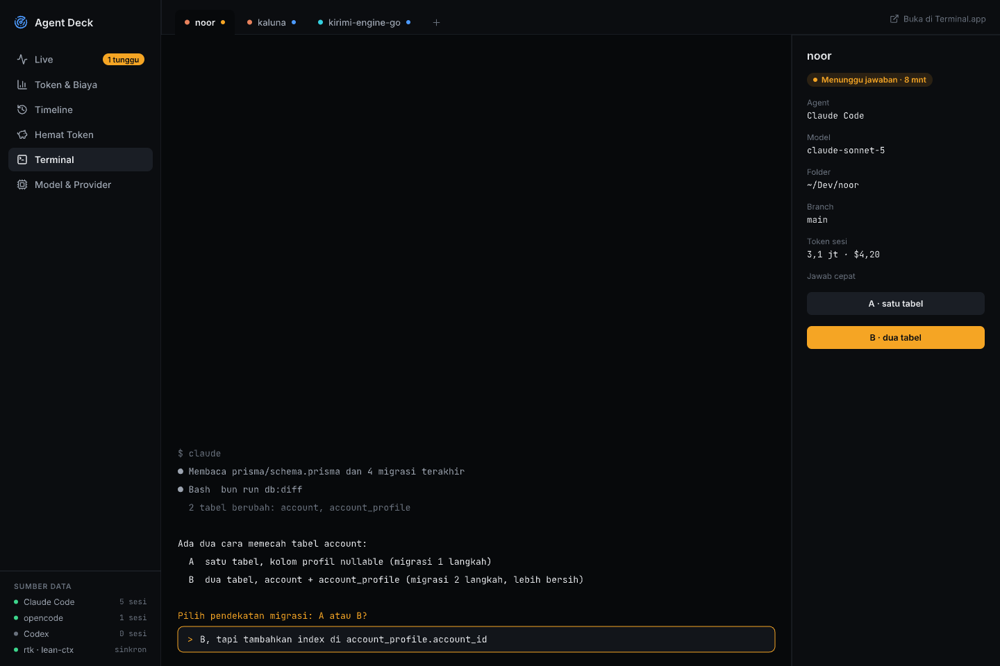
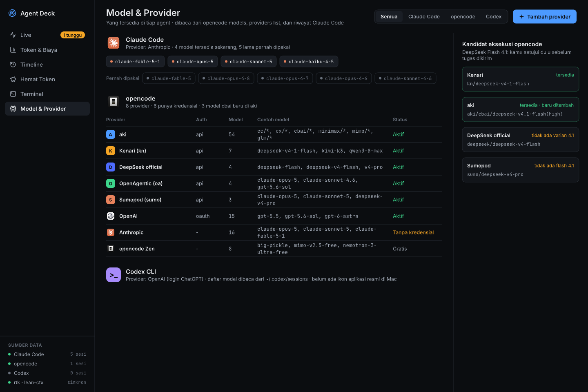
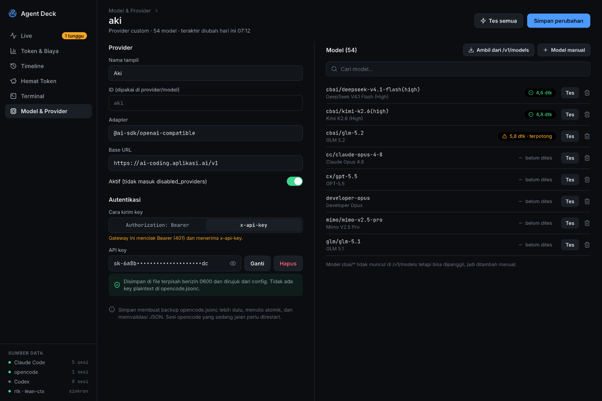

<p align="center">
  
</p>

<h1 align="center">Agent Deck</h1>
<p align="center">A local desktop dashboard that shows what every coding agent on your machine is doing right now, and how much it costs.</p>

<p align="center">
  
</p>

A local desktop dashboard (Tauri) that shows what every coding agent on your machine is doing right now, and how much it costs — in one place, instead of 3-5 terminals.

Covers **Claude Code**, **opencode**, and **Codex CLI**. Also tracks **rtk** and **lean-ctx** token savings.

All agent data is read-only — Agent Deck never writes to another agent's session, settings, or transcripts.

## Download

Grab the latest build from [GitHub Releases](https://github.com/yolkmonday/agent-deck/releases).

| OS / arch | Asset |
|---|---|
| macOS (Apple Silicon) | `.dmg` — `aarch64` |
| macOS (Intel) | `.dmg` — `x86_64` |
| Windows | `.msi`, or `-setup.exe` (NSIS) |
| Linux | `.AppImage`, or `.deb` (`.rpm` if available) |

Builds are unsigned:

- **macOS** — Gatekeeper will block the app. Run `xattr -dr com.apple.quarantine "/Applications/Agent Deck.app"`, or right-click the app → Open.
- **Windows** — SmartScreen will warn. Click "More info" → "Run anyway".

### Platform support

macOS and Linux are fully supported. On Windows, live process detection and recover actions (nudge, kill, restart) are unavailable — process management there is unix-only. History, tokens, timeline, and the provider admin UI still work.

## Features

- **Live Board** — session cards per agent (status: busy/waiting/idle, current tool, tokens, cost), KPI row, activity feed
- **Token & Cost** — per-day stacked bars by agent, per-model breakdown
- **Timeline** — per-session lanes of tool spans with a detail panel
- **Token Savings** — rtk / lean-ctx savings per day, top commands
- **Terminal** — embedded terminal tabs to jump into any session
- **Model & Provider** — opencode provider/model management (add provider, mask keys, test models)
- **Recover** — nudge, restart, or kill a stuck agent process

Mockups are in [`docs/design/`](docs/design). Architecture notes: [`docs/superpowers/specs`](docs/superpowers/specs).

## Screenshots

<table>
<tr>
<td width="50%">

**Token & Cost**


</td>
<td width="50%">

**Timeline**


</td>
</tr>
<tr>
<td width="50%">

**Token Savings**


</td>
<td width="50%">

**Terminal**


</td>
</tr>
<tr>
<td width="50%">

**Model & Provider**


</td>
<td width="50%">

**Model & Provider — edit**


</td>
</tr>
</table>

## Usage

- **Live Board** — session cards show status (busy / waiting / idle, or stalled / slow when unhealthy), current tool, tokens, and cost. An attention bar above every page surfaces sessions waiting on input, unhealthy sessions, and orphaned processes, with a jump-to button. Recover actions (nudge, restart, kill) appear on unhealthy sessions. Subagents collapse under their parent card. Sessions sharing a project group under one card with a worktree count — opening the group lists every worktree session. Click a card's project name to open the live transcript: a polling view of messages, thinking blocks, and tool calls (nothing is persisted).
- **Token & Cost** — daily token/cost totals, cache-hit rate, and reasoning-token share, plus a per-model cost table. Billing is entered manually per account (subscription, prepaid, or pay-as-you-go) in a dialog; a monthly summary shows remaining subscription days, prepaid balance left, or month-to-date spend.
- **Timeline** — one lane per session, one block per tool call, filterable by range (30 min / 2 hr / today). Selecting a block shows its status, duration, and token usage in a detail panel.
- **Token Savings** — total tokens saved by rtk and lean-ctx, a daily breakdown chart, and a top-commands table.
- **Terminal** — open new terminal sessions per project and switch between tabs; sessions end when the app closes.
- **Projects** — save folders you start sessions in often; suggests folders seen in live sessions or history that aren't saved yet.
- **Model & Provider** — see the models available to each agent (Claude Code, opencode, Codex). Add an opencode provider, fetch or manually add its models, set per-model token limits, and Save — a "Belum disimpan" (unsaved changes) indicator shows next to the button until you do. Saving creates a timestamped backup of `opencode.jsonc` you can restore later; running opencode sessions need to be restarted to pick up the change.

## Where data comes from

Agent Deck reads local files only — it never talks to Claude Code, opencode, or Codex over a network.

| Source | Path |
|---|---|
| Claude Code sessions | `~/.claude/projects` |
| opencode sessions | `~/.local/share/opencode/opencode.db` (SQLite) |
| opencode config (read) | `~/.config/opencode/opencode.jsonc` (or `.json`) |
| Codex CLI sessions | `~/.codex/sessions` |
| rtk savings | `~/Library/Application Support/rtk/history.db` (SQLite) |
| lean-ctx savings | `~/.lean-ctx/stats.json` |

The one thing Agent Deck writes is opencode's own config, and only when you save a provider in Model & Provider: `~/.config/opencode/opencode.jsonc`. Saves are atomic (write to a temp file, then rename) and always create a timestamped backup first (`opencode.jsonc.bak-<timestamp>`, up to 10 kept). API keys are never stored inline — each is written to its own `0600` file under `~/.config/opencode/secrets/`, and the config only references the file.

## Prerequisites

- [Bun](https://bun.sh) 1.x
- [Rust](https://www.rust-lang.org/tools/install) (stable toolchain, for the Tauri backend)
- Tauri's platform dependencies — see the [Tauri prerequisites guide](https://v2.tauri.app/start/prerequisites/) for your OS (Xcode CLT on macOS, WebView2 on Windows, `libwebkit2gtk` etc. on Linux)

## Running

```bash
bun install
bun run tauri dev
```

This launches the desktop app with hot reload. On first run Tauri compiles the Rust backend, which takes a while.

To run only the frontend in a browser (no Tauri backend, limited functionality):

```bash
bun run dev
```

## Building

```bash
bun run tauri build
```

Produces a platform-native installer/bundle under `src-tauri/target/release/bundle/`.

## Releasing

To cut a release:

1. Bump the version in `src-tauri/tauri.conf.json`, `package.json`, and `src-tauri/Cargo.toml` (all three carry a `version` field and should stay in sync).
2. `git tag vX.Y.Z && git push origin vX.Y.Z`

This triggers [`.github/workflows/release.yml`](.github/workflows/release.yml), which builds all platforms and creates a draft GitHub Release. A maintainer reviews and publishes it manually.

## Tests

```bash
bun test              # frontend
cd src-tauri && cargo test   # backend (collector + commands)
```

## Project structure

```
agent-deck/
  src-tauri/
    crates/collector/   # lib: reads agent session data, pricing, storage (no Tauri dependency)
    src/                 # Tauri app: commands, events, terminal, opencode admin
  src/                   # React + Vite + TypeScript + Tailwind + shadcn/ui
  docs/                  # design mockups and specs
```

## Tech stack

React 19, Vite, TypeScript, Tailwind CSS v4, Zustand, TanStack Query, xterm.js, recharts — on a Tauri v2 (Rust) backend.

## FAQ / Troubleshooting

**Models I added aren't showing up in opencode.**
Make sure you clicked Save (a "Belum disimpan" indicator shows if you haven't), then restart the opencode session — it reads provider config once at startup. Verify with `opencode models`.

**No live sessions detected on Windows.**
Expected — see [Platform support](#platform-support). History, tokens, timeline, and the provider admin UI still work; only live process detection and recover actions are unix-only.

**macOS says the app is damaged / can't be opened.**
See the unsigned-build note under [Download](#download).

## Privacy

Agent Deck is fully local — no telemetry, no analytics, no crash reporting, no update checker. The only outbound network calls happen when you use Model & Provider to fetch a provider's model list or test a model; both go directly to the provider you configured, triggered only by that action.

## License

[MIT](LICENSE)
